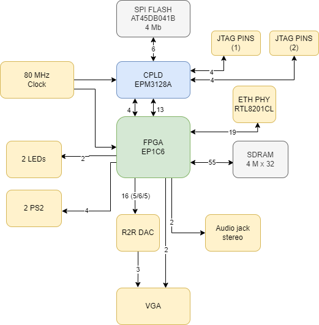

# Ncomputing-L130
The idea of this project is to reverse engineer the Ncomputing L130 PCB (rev 1.3A), to be able to use it as a generic FPGA development board.

Status:
- ✅ Reverse engineer main components and connections
- ✅ Basic Blinky test for CPLD
- ✅ Using Passive Serial Configuration for loading FPGA bitstream (CPLD passes through programming signals to FPGA)
- ✅ Reverse engineer full board
- ✅ Blinky in FPGA
- ❌ CPLD code to load FPGA bitstream from serial flash
- ❌ Retrocomputing using [multicomp](http://searle.x10host.com/Multicomp/index.html)
- ❌ Serial port FPGA
- ❌ Sound output
- ❌ Keyboard input
- ❌ VGA output
- ❌ Mouse input
- ❌ External SDRAM
- ❌ Ethernet: raw tx and rx
- ❌ Ethernet: udp tx and rx

# Schematic, component list and PCB photos

[PDF of the Schematic](docs/img/pcb.pdf)

KiCad files can be found in the `pcb/` folder.

[Full component list here (may be missing some values, or have errors)](docs/components.csv)

[PCB Top layer](docs/img/top.jpg) / [PCB Bottom layer](docs/img/bottom.jpg)

# Block diagram

# Projects 

The following folders contain `vhd` files that can be used to create a _Quartus II_ project for this board:
- cpld_passthrough: This generates a CPLD bitstream that makes it work as a passthrough so we can send the signals required for programming the FPGA.
- fpga_blink: This generates a FPGA bitstream that blinks the LEDs.

[Getting started: guide to building the projects and programming the board](docs/getting-started.md)

# Documentation

The [docs](docs/) folder contains many documents that are useful for this project.

**When using Quartus to generate the bitstream, remember that by default non defined pins are marked as outputs and are LOW. This can cause short circuits and destroy the rest of the circuit. To avoid that, you should go to Assignments->Device->Device and Pin Options...->Unused Pins and set it to "As input tri-stated with weak pull-up". DO THIS FOR BOTH PROJECTS!**

# Thanks to
[Carlos Pantelides (cpantel)](https://github.com/cpantel/)

# Inspirations
- https://github.com/UzixLS/ncomputing-l230
